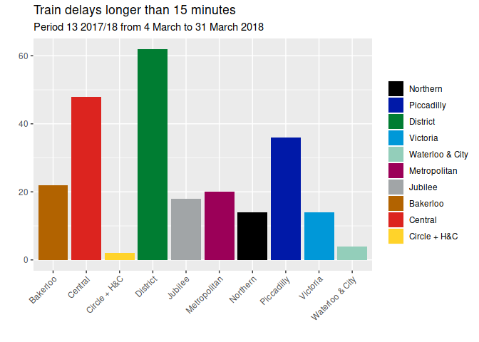

<!-- README.md is generated from README.Rmd. Please edit that file -->

# underground

**Updated on 2018-02-12 with data up to 2018-01-06**

London Underground performance data is published in
[spreadsheets](https://tfl.gov.uk/corporate/publications-and-reports/underground-services-performance).
This R package makes it available in [csv
files](https://github.com/nacnudus/underground/tree/master/inst/extdata),
or in an R data frame.

The secret sauce is [tidyxl](https://nacnudus.github.io/tidyxl) with a
dash of [unpivotr](https://nacnudus.github.io/unpivotr).

## Installation

``` r
devtools::install_github("nacnudus/underground")
```

## Example

``` r
library(underground)
library(dplyr)
library(ggplot2)

underground %>%
  filter(metric == "Train delays longer than 15 minutes",
         year == "2017/18",
         is.na(quarter),
         period == 9,
         line != "All Lines") %>%
  mutate(fill= underground_colours[line]) %>%
  select(line, value, fill) %>%
  ggplot(aes(line, value, fill = fill)) +
  geom_bar(stat = "identity") +
  scale_fill_identity("", labels = underground_lines, guide = "legend") +
  theme(axis.text.x = element_text(angle = 45, hjust = 1)) +
  xlab("") +
  ylab("") +
  ggtitle("Train delays longer than 15 minutes",
          subtitle = "Period 9 2017/18 from 12 November 2017 to 9 December 2017")
```



## Control periods

Most series are reported in ‘periods’ approximately four weeks long,
used by the whole UK rail industry. Some periods are shorter or longer
so that each year is covered by exactly 13 periods, beginning on the
April the 1st.

Join the dataset `rail_periods` to resolve periods (1 to 13) to dates.

## Metrics

``` r
distinct(underground, metric) %>%
  pull(metric)
#>  [1] "Scheduled kilometres"                                                                                                              
#>  [2] "Scheduled kilometres - Peak"                                                                                                       
#>  [3] "Scheduled kilometres - Offpeak"                                                                                                    
#>  [4] "Operated kilometres"                                                                                                               
#>  [5] "Operated kilometres - Peak"                                                                                                        
#>  [6] "Operated kilometres - Off Peak"                                                                                                    
#>  [7] "% of Schedule Operated"                                                                                                            
#>  [8] "% of Schedule Operated - Peak"                                                                                                     
#>  [9] "% of Schedule Operated - Off Peak"                                                                                                 
#> [10] "% of Scheduled Kilometres (Excluding Industrial Action)"                                                                           
#> [11] "Timetabled kilometres"                                                                                                             
#> [12] "% of Timetabled Kilometres"                                                                                                        
#> [13] "Scheduled Journey Time"                                                                                                            
#> [14] "Total Journey Time"                                                                                                                
#> [15] "Excess Journey Time"                                                                                                               
#> [16] "Excess Journey Time (Excl Industrial Action)"                                                                                      
#> [17] "Excess AEI Time"                                                                                                                   
#> [18] "Excess Ticket Purchase Time"                                                                                                       
#> [19] "Excess Platform Wait Time"                                                                                                         
#> [20] "Excess On Train Time"                                                                                                              
#> [21] "Excess Station Journey Time"                                                                                                       
#> [22] "Excess Train Journey Time"                                                                                                         
#> [23] "Excess Planned Closures Time"                                                                                                      
#> [24] "Train delays longer than 15 minutes"                                                                                               
#> [25] "Station closures"                                                                                                                  
#> [26] "Average Lost Customer Hours per period - all causes and all attribution parties [Network by Line]"                                 
#> [27] "Escalator Availability"                                                                                                            
#> [28] "Lift Availability"                                                                                                                 
#> [29] "Rolling Stock MDBF (KM)"                                                                                                           
#> [30] "Number of Service Control failures"                                                                                                
#> [31] "Number of Track failures"                                                                                                          
#> [32] "Passenger Journeys ('000)"                                                                                                         
#> [33] "Number of Engineering overruns"                                                                                                    
#> [34] "Asset related LCH"                                                                                                                 
#> [35] "Escalator and Lift Mean Time Between Failures (Days)"                                                                              
#> [36] "Average Lost Customer Hours per period - all causes and all attribution parties [Network by category]"                             
#> [37] "Average Lost Customer Hours per period - all causes and all attribution parties [Bakerloo line by category]"                       
#> [38] "Average Lost Customer Hours per period - all causes and all attribution parties [Central line by category]"                        
#> [39] "Average Lost Customer Hours per period - all causes and all attribution parties [Circle and Hammersmith and City line by category]"
#> [40] "Average Lost Customer Hours per period - all causes and all attribution parties [District line by category]"                       
#> [41] "Average Lost Customer Hours per period - all causes and all attribution parties [Jubilee line by category]"                        
#> [42] "Average Lost Customer Hours per period - all causes and all attribution parties [Metropolitan line by category]"                   
#> [43] "Average Lost Customer Hours per period - all causes and all attribution parties [Northern line by category]"                       
#> [44] "Average Lost Customer Hours per period - all causes and all attribution parties [Piccadilly line by category]"                     
#> [45] "Average Lost Customer Hours per period - all causes and all attribution parties [Victoria line by category]"                       
#> [46] "Average Lost Customer Hours per period - all causes and all attribution parties [Waterloo and City line by category]"              
#> [47] "CSS Overall Evaluation"                                                                                                            
#> [48] "CSS Train Service"                                                                                                                 
#> [49] "CSS Train and Station Information"                                                                                                 
#> [50] "CSS Station Staff Helpfulness and Availability"                                                                                    
#> [51] "CSS Customer Safety and Security"                                                                                                  
#> [52] "CSS Cleanliness"                                                                                                                   
#> [53] "Operated kilometres - Peak and Off Peak breakdown"
```
