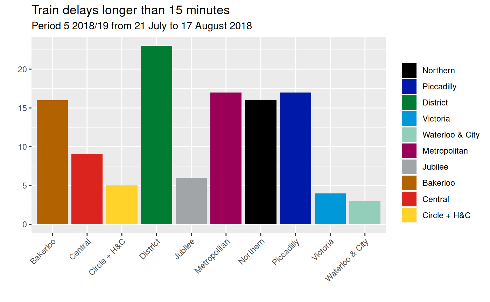

<!-- README.md is generated from README.Rmd. Please edit that file -->

# underground

**Updated on 2018-10-08 with data up to 2018-08-18**

London Underground performance data is published in
[spreadsheets](https://tfl.gov.uk/corporate/publications-and-reports/underground-services-performance).
This R package makes it available in [csv
files](https://github.com/nacnudus/underground/tree/master/inst/extdata),
or in an R data frame.

The secret sauce is [tidyxl](https://nacnudus.github.io/tidyxl) with a
dash of [unpivotr](https://nacnudus.github.io/unpivotr).

## Installation

``` r
devtools::install_github("nacnudus/underground")
```

## Example

``` r
library(underground)
library(dplyr)
library(ggplot2)

underground %>%
  filter(metric == "Train delays longer than 15 minutes",
         year == "2018/19",
         is.na(quarter),
         period == 5,
         line != "All Lines") %>%
  mutate(fill= underground_colours[line]) %>%
  select(line, value, fill) %>%
  ggplot(aes(line, value, fill = fill)) +
  geom_bar(stat = "identity") +
  scale_fill_identity("", labels = underground_lines, guide = "legend") +
  theme(axis.text.x = element_text(angle = 45, hjust = 1)) +
  xlab("") +
  ylab("") +
  ggtitle("Train delays longer than 15 minutes",
          subtitle = "Period 5 2018/19 from 21 July to 17 August 2018")
```



## Control periods

Most series are reported in ‘periods’ approximately four weeks long,
used by the whole UK rail industry. Some periods are shorter or longer
so that each year is covered by exactly 13 periods, beginning on the
April the 1st.

Join the dataset `rail_periods` to resolve periods (1 to 13) to dates.

## Metrics

``` r
distinct(underground, metric) %>%
  pull(metric)
#>  [1] "% of Schedule Operated"                                                                                                            
#>  [2] "% of Schedule Operated - Off Peak"                                                                                                 
#>  [3] "% of Schedule Operated - Peak"                                                                                                     
#>  [4] "% of Scheduled Kilometres (Excluding Industrial Action)"                                                                           
#>  [5] "% of Timetabled Kilometres"                                                                                                        
#>  [6] "Asset related LCH"                                                                                                                 
#>  [7] "Average Lost Customer Hours per period - all causes and all attribution parties [Bakerloo line by category]"                       
#>  [8] "Average Lost Customer Hours per period - all causes and all attribution parties [Central line by category]"                        
#>  [9] "Average Lost Customer Hours per period - all causes and all attribution parties [Circle and Hammersmith and City line by category]"
#> [10] "Average Lost Customer Hours per period - all causes and all attribution parties [District line by category]"                       
#> [11] "Average Lost Customer Hours per period - all causes and all attribution parties [Jubilee line by category]"                        
#> [12] "Average Lost Customer Hours per period - all causes and all attribution parties [Metropolitan line by category]"                   
#> [13] "Average Lost Customer Hours per period - all causes and all attribution parties [Network by category]"                             
#> [14] "Average Lost Customer Hours per period - all causes and all attribution parties [Network by Line]"                                 
#> [15] "Average Lost Customer Hours per period - all causes and all attribution parties [Northern line by category]"                       
#> [16] "Average Lost Customer Hours per period - all causes and all attribution parties [Piccadilly line by category]"                     
#> [17] "Average Lost Customer Hours per period - all causes and all attribution parties [Victoria line by category]"                       
#> [18] "Average Lost Customer Hours per period - all causes and all attribution parties [Waterloo and City line by category]"              
#> [19] "CSS Cleanliness"                                                                                                                   
#> [20] "CSS Customer Safety and Security"                                                                                                  
#> [21] "CSS Overall Evaluation"                                                                                                            
#> [22] "CSS Station Staff Helpfulness and Availability"                                                                                    
#> [23] "CSS Train and Station Information"                                                                                                 
#> [24] "CSS Train Service"                                                                                                                 
#> [25] "Escalator and Lift Mean Time Between Failures (Days)"                                                                              
#> [26] "Escalator Availability"                                                                                                            
#> [27] "Excess AEI Time"                                                                                                                   
#> [28] "Excess Journey Time"                                                                                                               
#> [29] "Excess Journey Time (Excl Industrial Action)"                                                                                      
#> [30] "Excess On Train Time"                                                                                                              
#> [31] "Excess Planned Closures Time"                                                                                                      
#> [32] "Excess Platform Wait Time"                                                                                                         
#> [33] "Excess Station Journey Time"                                                                                                       
#> [34] "Excess Ticket Purchase Time"                                                                                                       
#> [35] "Excess Train Journey Time"                                                                                                         
#> [36] "Lift Availability"                                                                                                                 
#> [37] "Number of Engineering overruns"                                                                                                    
#> [38] "Number of Service Control failures"                                                                                                
#> [39] "Number of Track failures"                                                                                                          
#> [40] "Operated kilometres"                                                                                                               
#> [41] "Operated kilometres - Off Peak"                                                                                                    
#> [42] "Operated kilometres - Peak"                                                                                                        
#> [43] "Passenger Journeys ('000)"                                                                                                         
#> [44] "Rolling Stock MDBF (KM)"                                                                                                           
#> [45] "Scheduled Journey Time"                                                                                                            
#> [46] "Scheduled kilometres"                                                                                                              
#> [47] "Scheduled kilometres - Offpeak"                                                                                                    
#> [48] "Scheduled kilometres - Peak"                                                                                                       
#> [49] "Station closures"                                                                                                                  
#> [50] "Timetabled kilometres"                                                                                                             
#> [51] "Total Journey Time"                                                                                                                
#> [52] "Train delays longer than 15 minutes"
```
